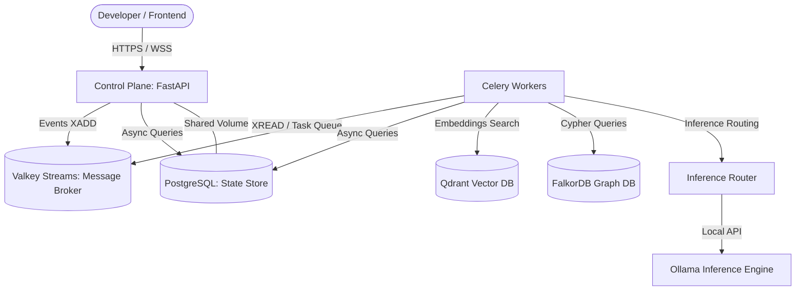

# 🪐 NeuralFolk

> **"What Docker did for containers, NeuralFolk does for AI inference."**

NeuralFolk is a self-hosted, open-source, air-gapped AI runtime Operating System. It enables companies, developers, and researchers to orchestrate state-of-the-art AI agents, multi-model workflows, and vector/graph hybrid memory completely locally—from an RTX 2070 laptop to high-scale enterprise clusters. **Zero API keys, zero vendor lock-in, 100% privacy.**

---

## 🎯 Objectives & Vision

Large Language Models should be treated as core utilities, not metered APIs. The open-source community has delivered elite local models (Qwen, Gemma, Llama, Phi), but operationalizing them into production-grade pipelines remains complex. NeuralFolk acts as the unified middleware layer:

*   **Self-Hosted Sovereignty**: Complete data privacy. Runs natively in air-gapped, firewalled environments with zero external phone-homes.
*   **Universal Inference Layer**: Abstraits backend engines (Ollama, vLLM, SGLang, llama.cpp, TensorRT) under a single, highly optimized dynamic routing API.
*   **Hybrid Memory System**: Merges semantic vector embeddings (Qdrant) and entity-relationship knowledge graphs (FalkorDB) to give agents human-like context recall.
*   **Distributed Task Orchestration**: Uses Celery and Valkey Streams to drive reactive, parallelized multi-agent loops and complex DAG workflows.

---

## 🏗️ Architecture & Stack Matrix

NeuralFolk utilizes an elite, fully open-source, and highly optimized stack designed for maximum throughput and minimal VRAM footprints:



### Core Technologies

| Service | Technology | Version | Purpose |
|---|---|---|---|
| **Control Plane** | FastAPI | `0.115+` | REST API, WebSockets feed, event dispatching, orchestration |
| **Task Worker** | Celery | `5.4+` | Reactive agent loops, skills, and DAG engine |
| **Primary Broker** | Valkey | `7.2+` | Celery broker, connection cache, fan-out event streams (MIT fork of Redis) |
| **Metadata Store** | PostgreSQL | `16` | Persistent state storage (workflows, configurations, agents) |
| **Vector Memory** | Qdrant | `latest` | High-dimensional semantic vector storage (quantized via TurboVec) |
| **Graph Memory** | FalkorDB | `latest` | Cyber queryable, entity-relation knowledge graph memory |
| **Local LLM API** | Ollama | `latest` | High-efficiency local inference backend |
| **Dashboard UI** | Next.js | `14` | Next App Router administration dashboard |

---

## 📂 Repository Directory Skeleton

```
neuralfolk/
├── docker-compose.yml          # Production services cluster mapping
├── docker-compose.dev.yml      # Local volume dev mounts (hot-reloads)
├── .env.example                # Canonical environment configurations template
├── Makefile                    # Developer CLI commands utility
│
├── services/
│   ├── control-plane/          # FastAPI 0.115+ Backend Application
│   │   ├── main.py             # Entrypoint utilizing modern lifespan pooling
│   │   ├── core/               # Pydantic settings, databases, Valkey drivers
│   │   ├── api/routes/         # Health checks, agents, inference endpoints
│   │   └── Dockerfile          # Multi-stage python:3.12-slim production build
│   │
│   ├── inference/              # Inference routing abstraction layer
│   │   ├── router.py           # Multi-backend query selector
│   │   └── backends/           # Ollama, vLLM, SGLang, llama.cpp integrations
│   │
│   ├── worker/                 # Distributed Celery task consumers
│   │   ├── celery_app.py       # Distributed execution queues config
│   │   ├── agent/              # Reactive planning, executing, orchestrating loops
│   │   └── tools/              # Filesystem, web search, sandboxed runtimes
│   │
│   ├── memory/                 # Qdrant Vector & FalkorDB Graph hybrid memory
│   └── dashboard/              # Next.js 14 Web Interface
│
├── skills/                     # Injectable Capabalities API registry
├── templates/                  # Standard Agent blueprints (e.g. competitor monitor)
└── tests/                      # Testing suites
    ├── unit/                   # Isolated unit test packages
    ├── integration/            # Multi-container integration tests
    └── TESTS.md                # Master testing validation ledger
```

---

## 🚀 Getting Started

### Prerequisites
*   [Docker Desktop](https://www.docker.com/products/docker-desktop/) (v24.0+)
*   [Python 3.12](https://www.python.org/downloads/release/python-3120/) (If running test runners on local host)

### Quickstart Setup

1.  **Clone and Navigate to the Repository**:
    ```bash
    git clone https://github.com/osamaaltaf-pk/NeuralFolk.git
    cd NeuralFolk
    ```

2.  **Configure Environment Variables**:
    Copy the example template configuration:
    ```bash
    cp .env.example .env
    ```

3.  **Spin Up the Stack**:
    Build and start all services via Docker Compose:
    ```bash
    docker compose up --build -d
    ```
    Once healthy, the Control Plane API will be active on [http://localhost:8000](http://localhost:8000) and the Next.js Dashboard on [http://localhost:3000](http://localhost:3000).

4.  **Confirm Uptime Health**:
    Query the API endpoint to verify connectivity to all database clusters:
    ```bash
    curl http://localhost:8000/api/v1/health
    ```

---

## 🧪 Rigorous Testing Mandate

NeuralFolk operates under a **strict testing constitution**. We enforce a highly accurate, test-driven ecosystem:

*   **Test-First Principle**: Every single feature, stack change, or bug resolution **MUST** have matching test files (e.g., `test_*.py`) created inside the `tests/` folder.
*   **The TESTS.md Ledger**: All active tests and pytest run results must be updated inside the [tests/TESTS.md](file:///c:/Users/Microsoft/Downloads/NeuralFolk/tests/TESTS.md) tracking ledger before any branch merge.
*   **Command References**:
    ```bash
    # Run all tests
    pytest tests/
    
    # Run only isolated unit tests (using FastAPI dependency overrides)
    pytest tests/unit/
    ```

---

## 🤝 How to Collaborate & Contribute

We welcome and encourage developers from all over the world to join the NeuralFolk ecosystem! To get involved:

### 1. Contribution Flow
1.  Fork the repository and create your feature branch: `git checkout -b feat/my-amazing-feature`.
2.  Follow the **Rigorous Testing Mandate**—ensure corresponding `test_*.py` files are created under `tests/` and pass.
3.  Format your code cleanly—ensure linting and typing checks pass (`make lint`).
4.  Submit a Pull Request targeting the `main` branch.

### 2. Strict Git Commit Conventions
We enforce semantic Git commit messages for clean automation and release logs:
```
<type>(<scope>): <short description in 10 words or less>
```
*   **Types**: `feat` | `fix` | `refactor` | `docs` | `chore` | `test`
*   **Scopes**: `control-plane` | `worker` | `dashboard` | `inference` | `memory` | `deploy` | `agent`
*   **Example**: `feat(control-plane): add PostgreSQL SQLAlchemy 2.0 async connections`

---

## 📄 License

NeuralFolk is distributed under the **Apache License 2.0**. This OSI-approved license allows commercial usage, modification, and private distribution, while offering explicit patent protection for both developers and contributors.
